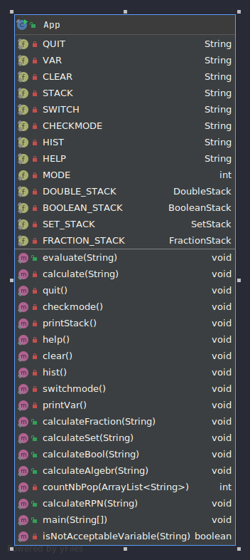
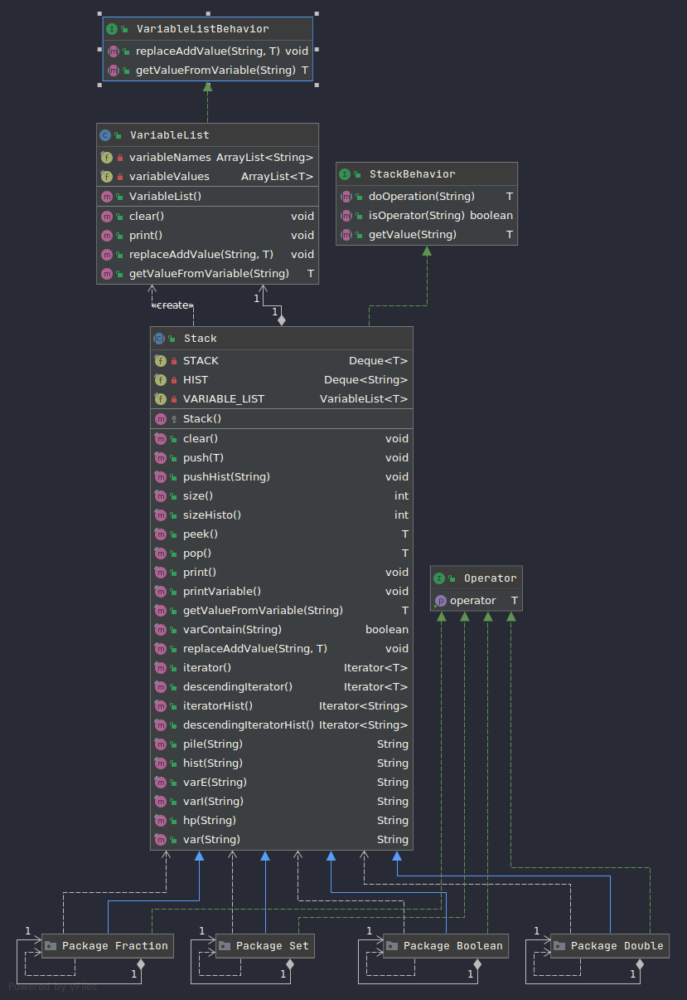
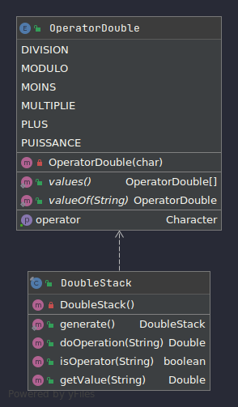
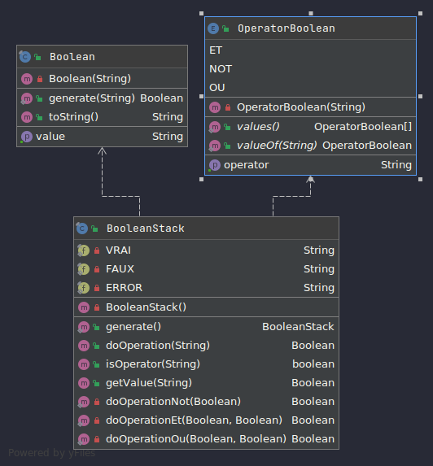
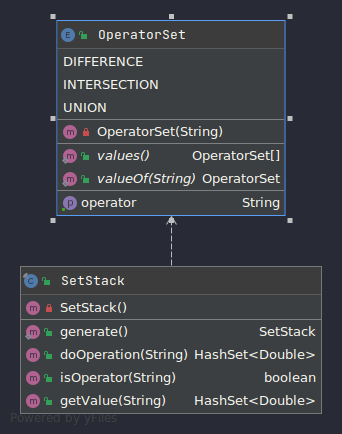
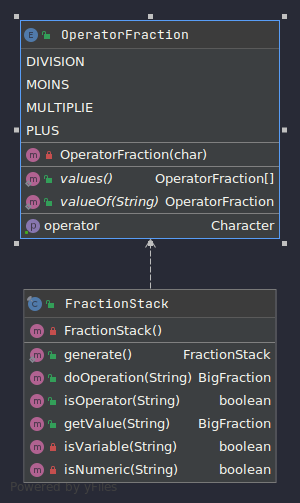
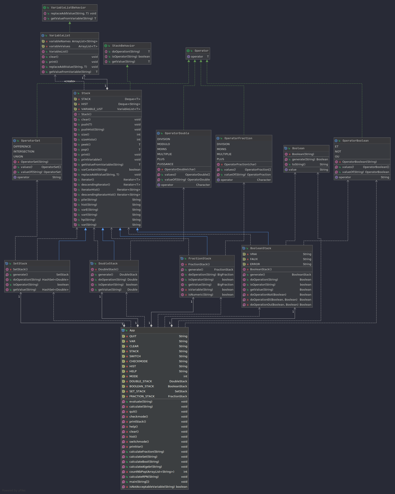

# Documentation technique

Cette documentation explique l'architecture du code, les relations entre les différentes classes et les implémentations

# Généralité

Cette application permet à un utilisateur d'utiliser la calculatrice afin de réaliser des simples calculs mathématique sur des nombres **décimaux** mais pas seulement car elle permet également de réaliser des opérations sur les **booléens**, les **ensembles** et les **fractions** avec différentes fonctionnalités pour la rendre plus puissante.

## Structure du code 

Le code est principalement composé de deux ***packages**, d'abord le package `Calculatrice` qui contient l'unique classe principal `App.java` qui est chargé de toutes les interactions de l'utilisateur avec le terminal.

Ensuite le package `Model` qui contient toutes le code qui effectue les calculs avant que `App.java` ne se charge de les afficher. Nous avons donc 3 interfaces: `StackBehavior.java` `VariableListBehavior.java` `Operator.java` ainsi qu'une classe abstraite `Stack.java` et une classe `VariableList.java`. Voici un résumé rapide de leur utilité, la documentation complète étant disponible en Javadoc (Rappel: gradle javadoc puis cd app/build/docs/javadoc) :
* `StackBehavior.java`: une interface **générique** qui contient les méthodes que devrons implémenter obligatoirement chaque pile, pour pouvoir fonctionner correctement. Ces méthodes sont `doOperation` qui se charge de faire les calculs, `isOperator` qui vérifie qu'une chaîne entré est un opérateur et `getValue` qui convertie une valeur entrée par l'utilisateur en un type correct pour réaliser le calcul. Cette interface est donc obligatoirement implémenté par `Stack.java`
* `Stack.java`: classe **abstraite générique** implémentant `StackBehavior.java` représentant une pile pour le calcul sous forme RPN, elle contient donc trois attributs, 2 Deques, 1 pour la pile de valeur et l'autre pour l'historique et une instance de VariableList pour gérer les variables. Toutes les méthodes sont déclaré final car elle ne doivent pas être redéfini par les sous-classes. Ces méthodes interagissent avec les attributs pour réaliser les opérations voulus. Il n'y a pas de getter ni de setter, nous ne pouvons donc pas accéder ou modifier ses attributs sauf en passant par les méthodes définies.
* `VariableListBehavior.java`:  Contient deux méthodes principaux, `replaceAddValue(String s, T value)` et `getValueFromVariable(String s)`. L'un crée une variable et y attribut une valeur, l'autre récupère la valeur selon la variable.
* `VariableList.java`: est un objet contenant deux ArrayList correspondant respectivement à la liste des variable et des valeurs correspondant.
* `Operator.java`: interface contenant une unique méthode getOperator qui renvoit un opérateur correspond à une énumération.

Nous avons enfin un **sous-package** par type que l'on souhaite implémenter dans la calculatrice donc ici nous avons pour l'instant `Double`, `Boolean` `Fraction` et `Set`.
Chacun de ses sous-packages contiennent au moins deux classes: une *pile* héritant de la classe abstraite `Stack.java` forcément final pour éviter tout **héritage non voulu** et une **énumération d'opérateur** disponible pour ce type.

## Relation entre les classes
Tout d'abord, le but était d'implémenter la pile de façon **générique** afin d'ensuite introduire le type de donnée sur lequel faire les traitements plus tard. C'est pourquoi chaque *pile de valeur* hérite de la classe `Stack.java`. Via ce procédé nous avons simplifié nos ajouts de nouveau type sur lesquels faire des opérations. En effet chaque pile réimplémente `doOperation` en fonction des opérations que nous souhaitons faire sur tel type de donnée. Crée un sous-package par sous-type nous a permis "d'encapsuler" les méthodes par type de donnée, nous étions donc assuré que pour chaque bug trouvé, nous n'avions qu'à chercher uniquement dans le package concerné et non pas ailleurs ce qui nous a grandement faciliter la tâche lorsque les tests Junit n'était pas concluant.
La présence classe implémentant `Opérator.java` permet uniquement de s'assurer des opérations disponible sur un type donné.
Le choix de crée une pile par type de donnée n'est pas la plus optimisé mais permet d'éviter tout les problèmes de conflit entre types lors de la réalisation d'un calcul (somme d'un ensemble et d'un string par exemple).
Ensuite lorsque nous avons dû implémenter d'autres fonctionnalités comme l'historique et les variables, il a semblé clair que ces fonctionnalités étaient communes à toutes les piles, c'est pourquoi ces méthodes ont été codés dans la classe abstraite `Stack.java` afin que toutes ces fonctionnalités puissent être disponible pour tous indépendamment du type.

