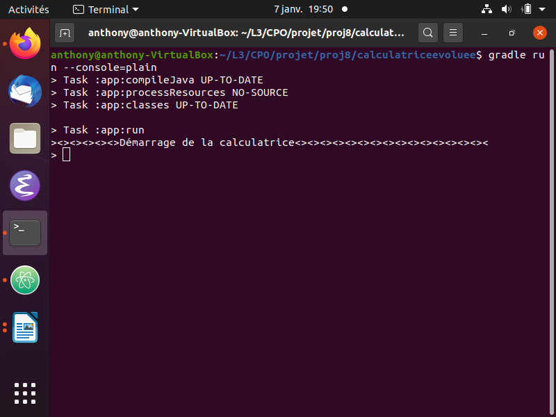
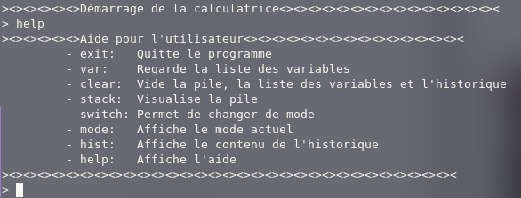
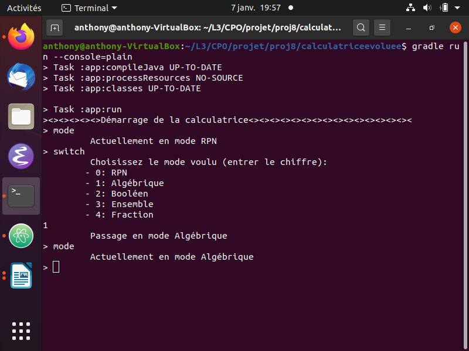
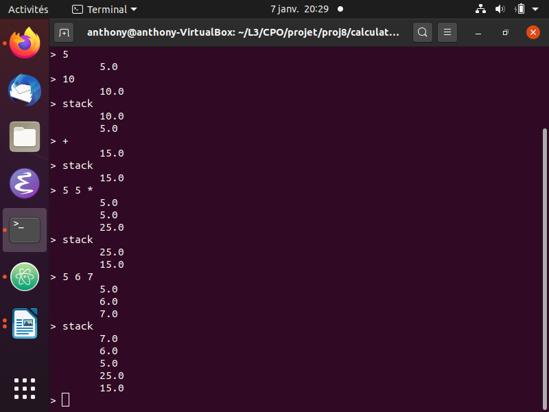
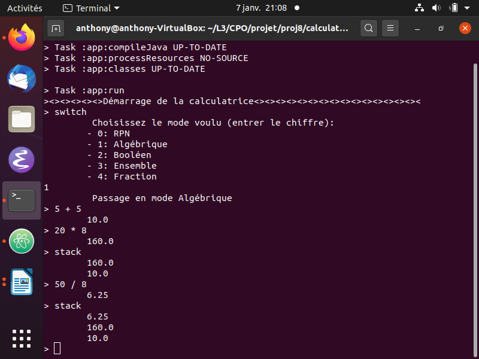
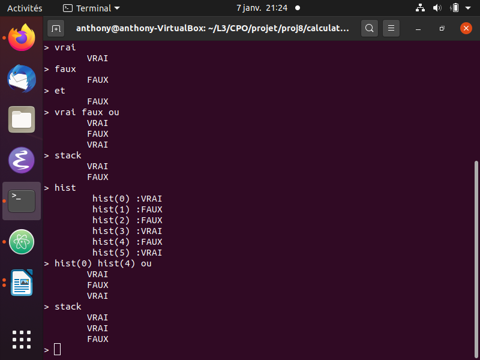
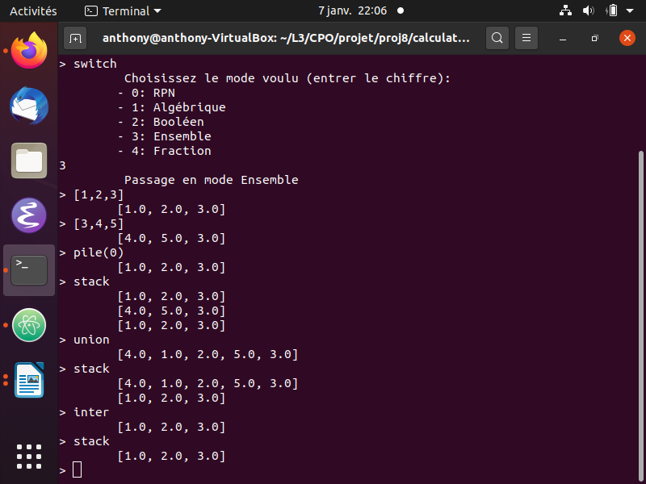
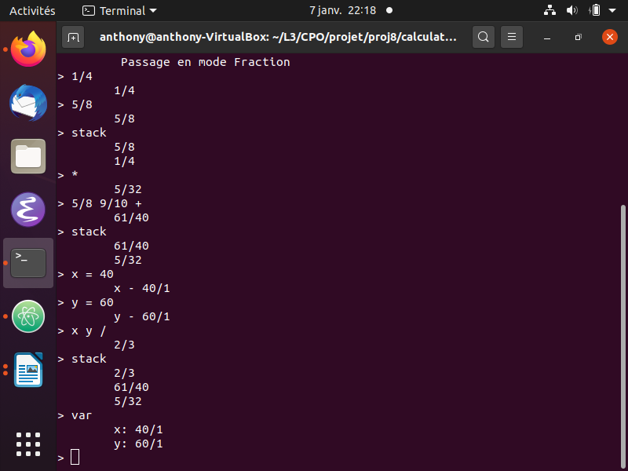
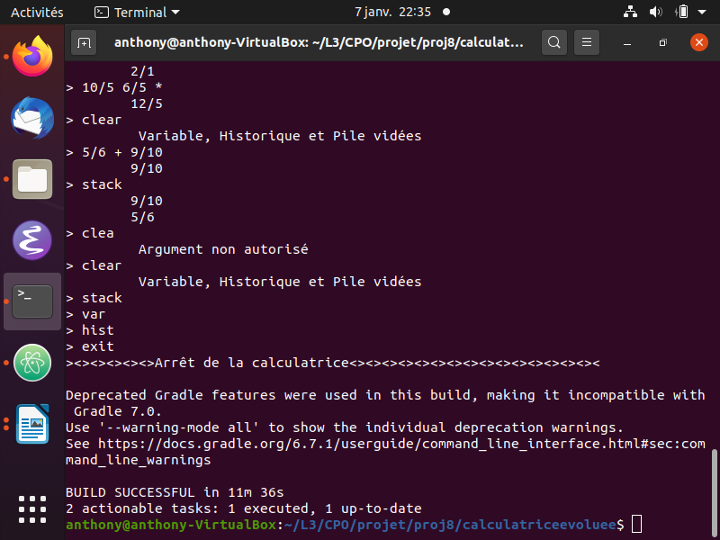

# Manuel utilisateur

## Presentation de l’interface
Cette documentation s’adresse à l’utilisateur voulant utiliser la calculatrice,
expliquant ces fonctionnalités 

Le démarrage de la calculatrice se fait avec la commande `gradle build` puis `gradle run –console=plain`. A la suite de cela, la *calculatrice* se met en marche attendant une *commande de l’utilisateur*, le mode de départ étant **RPN**.

## Commandes: `help`

La commande `help` permet d'afficher toutes les commandes disponibles et ce qu'elles font

## Commandes: `mode` et `switch`

La commande `mode` permet de savoir quel est le **mode** actuel, quand à `switch`, elle attend une *entrée de l’utilisateur* permettant de basculer entre différents **modes**.

## Commandes pour le mode RPN et `stack` (ou `pile`)

Le mode **RPN** prend des entrées de la forme **int**, **Double** et ou **variables**. Lors de l’entrée d’une unique valeur, cette valeur sera insérée directement dans la pile, plusieurs valeurs peut être entrées en même temps. Si un opérateur `+ - / * ^ %` est entré et que la pile contient plus de 2 valeurs le calcul est réalisé et le résultat est empilé. 
Nous pouvons aussi faire des opérations de la forme (x y opérateurs) par exemple 5 5 * ce qui multiplieras 5 et 5 et empileras 25.

La commande `stack` (ou `pile`) quand à elle permet de voir ce qui a été empilé dans la pile courante affichant le dernier éléments empilé du _haut vers le bas_. Cette commande fonctionne bien sûr pour tout les modes.

## Commandes pour le mode algébrique

Le mode **Algébrique** permet d’utiliser des opérations de la forme (x opérateur y) par exemples 5 + 5 ce qui empilera 10 ou 20 * 8 ce qui empilera 160.

## Commandes pour le mode Boolean et `hist`

Le mode **Boolean** attend une valeur de la forme `vrai` ou `faux` ou `not` (not s’utilise de la forme vrai not par exemple) a la suite d’une valeur celle-ci sera empilé dans la pile. 
Si un `et` ou `ou` sont entrées et que la pile contient au moins 2 valeur alors l’opération de vérité sera fait et le résultat sera empilé. 
Une opération peut aussi se faire sur une ligne de la forme (x y opérateur) par exemple «vrai faux et» ce qui empilera donc faux.

La commande `hist` permet quand à elle de regarder les commandes passé, si `hist` et suivi de (x) alors *hist(x)* empilera x dans la pile.
Les *hist(x)* peuvent aussi être utilisé dans une opération par exemple dans Boolean la commande `hist(0) hist(4) ou` empilera faux car hist(0) correspond a vrai et hist(4) correspond a faux.
Si (x) est une valeur négative alors l’ordre du choix sera inversé. Il faut aussi prendre en compte que si une valeur est empilé avant hist(x) la valeur de hist(x) peut être différente de ce que affiche `hist`.
La commande hist peut bien sûr être utilisée pour touts les modes.

## Commandes pour le mode Ensemble et `pile`

/

Le mode **Ensemble** attend un valeur ensemble de la forme [x,y,z, etc,,,,] et l’empile dans la pile, si une opération `inter` (Intersection) `union` (union des ensembles) ou `difference` (renvoie les valeurs qui ne sont pas en commun) et que 2 ensembles sont au moins dans la pile alors l’opération est réalisé et le résultat empilé. 
L’opération peut aussi se faire sur une ligne de la forme [x,y] [i,j] union par exemple.

La commande `pile` quand à elle permet de retourner la valeur de l’indice x dans la pile courante avec la commande pile(x), avec pile(0) _la base de la pile_ et pile(-1) _le sommet_. Les opérations avec pile(x) fonctionnent aussi, par exemple pour les ensembles `pile(0) pile(-1) union` fera l’union du sommet et de la base de la pile courante.
Bien sûr la commande pile(x) fonctionne dans tous les modes.

## Commandes pour le mode Fraction et l’utilisation de variables
					

Le mode **Fraction** attend une valeur de la forme x ou x/y avec x ou y des entiers ou Double. Lors de l'entrée d'une valeur, cette valeur sera empilé dans la pile.
Si un opérateur est entré alors le calcul est realisé et le résultat empilé.
Les opérations peuvent être écrites à la suite sous la forme 5/8 9/10 + comme montré ci-dessus.

Les variables s’initialise de la façon x = y (ou y est soit une autre variable ou soit une valeur). Une variable peut aussi être initialisée 
par exemple dans le mode Fraction par `x = 5/7 8/9 +` ou encore avec `!x` ou x aura la valeur du sommet de la pile, quand à `?x` retournera la valeur de x et l’empilera au sommet de la pile.
Les variables peuvent être utilisés dans des opérations par exemple ci-dessus x y / empilera 2/3 dans la pile.
La liste des variables peut être obtenu avec la commande `var`. Bien sûr les variables fonctionnent dans chaques modes.

## Commandes de nettoyage `clear` et `exit`

Et enfin pour finir, la commande `clear` permet de réinitialiser la _pile_, _l’historique_ et les _variables_ dans le mode actuelle. Quand à `exit` elle permet de _quitter_ la calculatrice,
